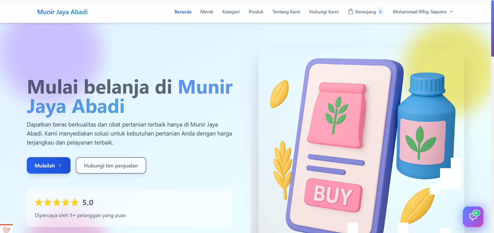
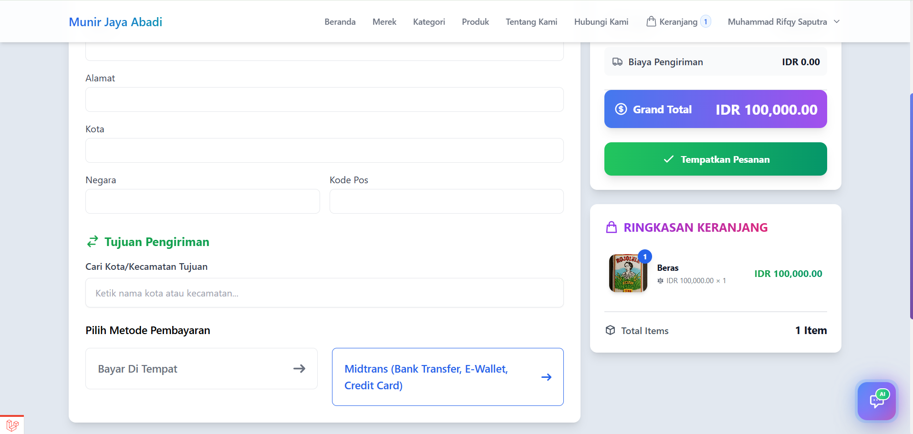
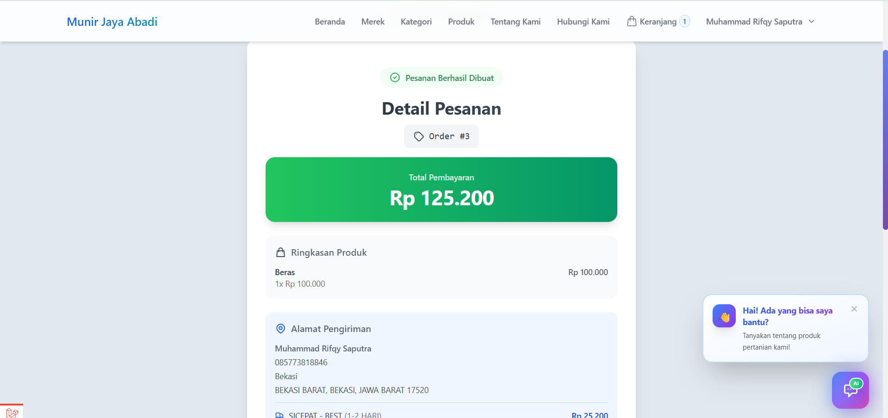
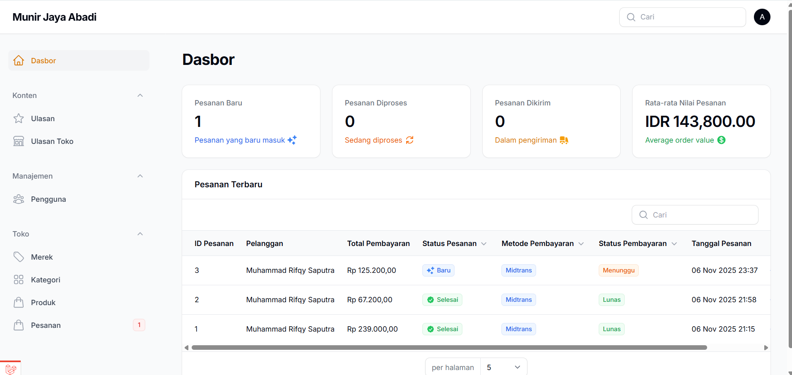

# 🛍️ Munir Jaya Abadi - E-Commerce Platform

[](https://laravel.com)
[](https://livewire.laravel.com)
[](https://filamentphp.com)
[](https://tailwindcss.com)
[](https://php.net)
[](https://mysql.com)

> Platform e-commerce modern dan lengkap dengan fitur admin panel, integrasi payment gateway, sistem pengiriman real-time, dan AI chatbot menggunakan teknologi terkini.

**🌐 Live Demo**: [munirjayaabadi.sikcb.my.id](https://munirjayaabadi.sikcb.my.id/)

---

## 📋 Daftar Isi

-   [Tentang Project](#-tentang-project)
-   [Fitur Utama](#-fitur-utama)
-   [Tech Stack](#-tech-stack)
-   [Persyaratan Sistem](#-persyaratan-sistem)
-   [Instalasi](#-instalasi)
-   [Konfigurasi](#-konfigurasi)
-   [Database Schema](#-database-schema)
-   [API Documentation](#-api-documentation)
-   [Deployment](#-deployment)
-   [Screenshot](#-screenshot)
-   [Kontributor](#-kontributor)
-   [Lisensi](#-lisensi)

---

## 🎯 Tentang Project

> Platform e-commerce full-stack yang dibangun menggunakan Laravel 11 dengan Livewire 3 untuk interaktivitas real-time, Filament 3 untuk admin panel yang powerful, dan **RESTful API lengkap** untuk integrasi mobile app.

### 🌟 Highlight

-   ✨ **Modern UI/UX** dengan TailwindCSS dan dark mode support
-   🚀 **Real-time** interaktivity dengan Livewire
-   🎨 **Powerful Admin Panel** menggunakan Filament 3
-   📱 **Complete REST API** dengan 43 endpoints untuk mobile app
-   💳 **Multi Payment Gateway** (Midtrans, Stripe, COD)
-   📦 **Real-time Shipping** calculation dengan RajaOngkir API
-   🤖 **AI Chatbot** powered by Google Gemini
-   📧 **Email Notifications** untuk order management
-   🔐 **Secure Authentication** dan authorization
-   📱 **Fully Responsive** design
-   🌐 **SEO Optimized** dengan meta tags lengkap
-   🇮🇩 **Localized** untuk Indonesia (Bahasa Indonesia)

### 🌟 Highlight

-   ✨ **Modern UI/UX** dengan TailwindCSS dan dark mode support
-   🚀 **Real-time** interaktivity dengan Livewire
-   🎨 **Powerful Admin Panel** menggunakan Filament 3
-   💳 **Multi Payment Gateway** (Midtrans, Stripe, COD)
-   📦 **Real-time Shipping** calculation dengan RajaOngkir API
-   🤖 **AI Chatbot** powered by Google Gemini
-   📧 **Email Notifications** untuk order management
-   🔐 **Secure Authentication** dan authorization
-   📱 **Fully Responsive** design
-   🌐 **SEO Optimized** dengan meta tags lengkap
-   🇮🇩 **Localized** untuk Indonesia (Bahasa Indonesia)

---

## ✨ Fitur Utama

### 🛒 Customer Features

#### 🏪 Shopping Experience

-   **Product Catalog** dengan filter dan sorting canggih
    -   Filter berdasarkan kategori, brand, harga, featured, on-sale
    -   Sorting by latest, price (low-high, high-low)
    -   Search functionality
    -   Product detail dengan multiple images
-   **Shopping Cart** dengan real-time updates
    -   Add/remove items
    -   Quantity adjustment
    -   Price calculation otomatis
    -   Persistent cart (cookie-based)
-   **Wishlist** untuk save produk favorit

#### 💰 Checkout & Payment

-   **Smart Checkout Flow**
    -   Real-time shipping cost calculation
    -   Multiple courier options (JNE, TIKI, POS, J&T, SiCepat, dll)
    -   Automatic address autocomplete via RajaOngkir
    -   ETD (Estimated Time Delivery) information
-   **Payment Methods**
    -   **Midtrans** (Credit Card, e-Wallet, Bank Transfer, dll)
    -   **Stripe** (International payments)
    -   **COD** (Cash on Delivery)
-   **Order Management**
    -   Order history tracking
    -   Real-time status updates
    -   Email notifications
    -   Invoice download (PDF)
    -   Waybill tracking

#### 🤖 AI Features

-   **Chatbot** powered by Google Gemini AI
    -   Product recommendations
    -   Customer support
    -   Order inquiry
    -   FAQs assistance

#### 👤 User Account

-   **Profile Management**
    -   Personal information
    -   Avatar upload
    -   Password change
    -   Email verification
-   **Order History**
    -   Detailed order view
    -   Status tracking
    -   Reorder functionality
-   **Product Reviews**
    -   Rating system (1-5 stars)
    -   Review submission
    -   Review moderation

---

### 🔧 Admin Features

#### 📊 Dashboard

-   **Analytics Overview**
    -   Total orders, revenue, customers
    -   Latest orders widget
    -   Revenue charts
    -   Best-selling products
-   **Statistics**
    -   Order status breakdown
    -   Payment status analytics
    -   Shipping method analysis

#### 🏢 Product Management

-   **CRUD Operations** untuk products
    -   Multiple image upload
    -   Category & brand assignment
    -   Stock management
    -   Pricing (regular price, sale price)
    -   Featured & on-sale flags
-   **Category Management**
    -   Hierarchical categories
    -   Image & icon support
    -   Active/inactive status
-   **Brand Management**
    -   Brand logos
    -   Brand visibility control

#### 📦 Order Management

-   **Comprehensive Order Control**
    -   Order listing dengan filter canggih
    -   Order detail view (infolist)
    -   Order status management (New → Processing → Shipped → Delivered)
    -   Payment status tracking
    -   Shipping information
    -   Quick actions (Ship, Cancel, Mark Delivered)
-   **Order Items**
    -   Product details
    -   Quantity & pricing
    -   Subtotal calculation
-   **Address Information**
    -   Customer delivery address
    -   Contact information

#### 👥 User Management

-   **Customer Management**
    -   User listing & search
    -   User details with avatar
    -   Email verification status
    -   Order history per user
    -   Quick access to user orders
-   **Role & Permission** (via Filament)

#### ⭐ Review Management

-   **Product Reviews**
    -   Review moderation
    -   Approval system
    -   Rating analytics
    -   Customer feedback
-   **Store Reviews**
    -   Overall store rating
    -   Customer satisfaction metrics
    -   Review aggregation
    -   Performance insights

#### 📧 Contact Messages

-   **Customer Inquiries**
    -   Contact form submissions
    -   Read/unread status
    -   Email responses

#### 📊 Analytics & Reporting

-   **Dashboard Analytics**
    -   Sales overview & trends
    -   Customer metrics
    -   Product performance
    -   Revenue reports
-   **Real-time Monitoring**
    -   Live order tracking
    -   Inventory alerts
    -   Customer activity
    -   System performance

#### 📝 Content Management

-   **Static Pages**
    -   About page management
    -   Contact information
    -   Terms & conditions
    -   Privacy policy
-   **SEO Management**
    -   Meta tags configuration
    -   Page titles & descriptions
    -   Open graph settings

#### ⚙️ System Configuration

-   **General Settings**
    -   Site information (name, logo, favicon)
    -   Contact details
    -   Social media links
    -   Business hours
-   **Payment Configuration**
    -   Midtrans settings
    -   Stripe integration
    -   COD options
-   **Shipping Settings**
    -   RajaOngkir API configuration
    -   Shipping zones & rates
    -   Courier preferences
-   **AI & Chatbot**
    -   Google Gemini API settings
    -   Chatbot behavior configuration
-   **Email Configuration**
    -   SMTP settings
    -   Email templates
    -   Notification preferences

#### 📱 API & Mobile Integration

-   **RESTful API v1**
    -   43 comprehensive endpoints
    -   Laravel Sanctum authentication
    -   JSON responses with pagination
    -   File upload support
    -   Rate limiting & CORS
-   **Mobile App Ready**
    -   Complete e-commerce functionality
    -   Real-time cart management
    -   Order tracking & payment
    -   User profile & reviews
    -   Push notification ready

---

## 🛠️ Tech Stack

### Backend

| Technology          | Version | Purpose              |
| ------------------- | ------- | -------------------- |
| **Laravel**         | 11.46.0 | PHP Framework        |
| **PHP**             | 8.2+    | Programming Language |
| **MySQL**           | 8.0+    | Database             |
| **Livewire**        | 3.5     | Full-stack Framework |
| **Filament**        | 3.2     | Admin Panel          |
| **Laravel Sanctum** | Latest  | API Authentication   |
| **Laravel Tinker**  | 2.9     | REPL                 |

### Frontend

| Technology      | Version | Purpose                             |
| --------------- | ------- | ----------------------------------- |
| **TailwindCSS** | 3.4.17  | CSS Framework                       |
| **Vite**        | 6.1.1   | Build Tool                          |
| **Axios**       | 1.7.4   | HTTP Client                         |
| **Preline**     | 2.7.0   | UI Components                       |
| **Alpine.js**   | -       | JavaScript Framework (via Livewire) |

### Integrations

| Service              | Purpose                     |
| -------------------- | --------------------------- |
| **Midtrans**         | Payment Gateway (Indonesia) |
| **Stripe**           | International Payment       |
| **RajaOngkir**       | Shipping Cost Calculation   |
| **Google Gemini AI** | AI Chatbot                  |
| **Gmail SMTP**       | Email Notifications         |

### Development Tools

| Tool                 | Version | Purpose      |
| -------------------- | ------- | ------------ |
| **Laravel Debugbar** | 3.16    | Debugging    |
| **Laravel Pint**     | 1.13    | Code Styling |
| **PHPUnit**          | 11.0.1  | Testing      |
| **Faker**            | 1.23    | Fake Data    |

---

## 💻 Persyaratan Sistem

### Minimum Requirements

```
- PHP >= 8.2
- Composer >= 2.0
- Node.js >= 18.x
- NPM >= 9.x
- MySQL >= 8.0 atau MariaDB >= 10.3
- Git
```

### PHP Extensions Required

```
- BCMath
- Ctype
- Fileinfo
- JSON
- Mbstring
- OpenSSL
- PDO
- PDO_MySQL
- Tokenizer
- XML
- cURL
- GD atau Imagick (untuk image processing)
```

### Server Requirements (Production)

```
- Apache/Nginx web server
- SSL Certificate (untuk HTTPS)
- Minimal 512 MB RAM (1 GB recommended)
- Minimal 1 GB disk space
- SSH access (untuk deployment)
```

---

## 🚀 Instalasi

### 1️⃣ Clone Repository

```bash
# Clone dari GitHub
git clone https://github.com/muris11/ecommerce_project2.git

# Masuk ke folder project
cd ecommerce_project2
```

### 2️⃣ Install Dependencies

```bash
# Install PHP dependencies
composer install

# Install JavaScript dependencies
npm install
```

### 3️⃣ Environment Configuration

```bash
# Copy file .env.example
cp .env.example .env

# Generate application key
php artisan key:generate
```

### 4️⃣ Database Setup

```bash
# Buat database MySQL
# Via MySQL CLI:
mysql -u root -p
CREATE DATABASE ecommerce_projeck2;
EXIT;

# Atau via phpMyAdmin/GUI tool

# Edit .env file dengan kredensial database Anda:
DB_CONNECTION=mysql
DB_HOST=127.0.0.1
DB_PORT=3306
DB_DATABASE=ecommerce_projeck2
DB_USERNAME=root
DB_PASSWORD=

# Jalankan migrasi
php artisan migrate

# (Optional) Seed database dengan data sample
php artisan db:seed
```

### 5️⃣ Storage Link

```bash
# Link storage untuk file upload
php artisan storage:link
```

### 6️⃣ Build Assets

```bash
# Development
npm run dev

# Production
npm run build
```

### 7️⃣ Run Application

```bash
# Development server
php artisan serve

# Aplikasi akan berjalan di http://localhost:8000
```

### 8️⃣ Create Admin User

```bash
# Via Tinker
php artisan tinker

# Jalankan command berikut:
\App\Models\User::create([
    'name' => 'Admin',
    'email' => 'admin@munirjayaabadi.com',
    'password' => bcrypt('password'),
    'email_verified_at' => now()
]);

# Exit tinker
exit

# Login ke admin panel di: http://localhost:8000/admin
# Email: admin@munirjayaabadi.com
# Password: password
```

---

## ⚙️ Konfigurasi

### Environment Variables

Edit file `.env` untuk konfigurasi:

#### Aplikasi Dasar

```env
APP_NAME="Munir Jaya Abadi"
APP_ENV=local
APP_DEBUG=true
APP_URL=http://localhost:8000
APP_TIMEZONE=Asia/Jakarta
APP_LOCALE=id
```

#### Database

```env
DB_CONNECTION=mysql
DB_HOST=127.0.0.1
DB_PORT=3306
DB_DATABASE=ecommerce_projeck2
DB_USERNAME=root
DB_PASSWORD=
```

#### Mail Configuration

```env
MAIL_MAILER=smtp
MAIL_HOST=smtp.gmail.com
MAIL_PORT=587
MAIL_USERNAME=your_email@gmail.com
MAIL_PASSWORD=your_app_password
MAIL_ENCRYPTION=tls
MAIL_FROM_ADDRESS=your_email@gmail.com
MAIL_FROM_NAME="${APP_NAME}"
```

**Cara mendapatkan Gmail App Password:**

1. Buka Google Account Settings
2. Security → 2-Step Verification → App passwords
3. Generate password untuk "Mail"
4. Copy password ke `MAIL_PASSWORD`

#### Midtrans Configuration

```env
MIDTRANS_MERCHANT_ID=your_merchant_id
MIDTRANS_CLIENT_KEY=your_client_key
MIDTRANS_SERVER_KEY=your_server_key
MIDTRANS_IS_PRODUCTION=false
MIDTRANS_IS_SANITIZED=true
MIDTRANS_IS_3DS=true
```

**Cara mendapatkan Midtrans credentials:**

1. Daftar di [Midtrans](https://midtrans.com)
2. Login ke Dashboard
3. Settings → Access Keys
4. Copy Client Key dan Server Key

#### Google Gemini AI

```env
GEMINI_API_KEY=your_gemini_api_key
GEMINI_MODEL=gemini-2.5-flash
GEMINI_MAX_TOKENS=500
GEMINI_TEMPERATURE=0.7
```

**Cara mendapatkan Gemini API Key:**

1. Buka [Google AI Studio](https://makersuite.google.com/app/apikey)
2. Create API Key
3. Copy ke `GEMINI_API_KEY`

#### Laravel Sanctum (API Authentication)

```env
SANCTUM_STATEFUL_DOMAINS=localhost:8000
SANCTUM_GUARD=web
```

#### Cache Configuration

```env
CACHE_DRIVER=file
SESSION_DRIVER=file
QUEUE_CONNECTION=database
```

#### File Storage

```env
FILESYSTEM_DISK=local
AWS_ACCESS_KEY_ID=
AWS_SECRET_ACCESS_KEY=
AWS_DEFAULT_REGION=us-east-1
AWS_BUCKET=
AWS_USE_PATH_STYLE_ENDPOINT=false
```

#### Application Cache Keys

```env
CACHE_KEYS_PRODUCTS=products_cache
CACHE_KEYS_CATEGORIES=categories_cache
CACHE_KEYS_PRODUCT_REVIEWS=product_reviews_cache
CACHE_KEYS_STORE_REVIEWS=store_reviews_cache
```

---

## 🗄️ Database Schema

### ERD (Entity Relationship Diagram)

```
┌─────────────┐       ┌──────────────┐       ┌─────────────┐
│   Users     │──────<│    Orders    │>──────│  Addresses  │
└─────────────┘       └──────────────┘       └─────────────┘
       │                       │
       │                       │
       ▼                       ▼
┌─────────────┐       ┌──────────────┐
│   Reviews   │       │ Order Items  │
└─────────────┘       └──────────────┘
                             │
                             │
                             ▼
                      ┌──────────────┐       ┌─────────────┐
                      │   Products   │──────<│  Categories │
                      └──────────────┘       └─────────────┘
                             │
                             │
                             ▼
                      ┌──────────────┐
                      │    Brands    │
                      └──────────────┘
```

### Tabel Utama

#### users

```sql
- id (PK)
- name
- email (unique)
- email_verified_at (nullable)
- password
- avatar (nullable)
- remember_token (nullable)
- created_at, updated_at
```

#### personal_access_tokens (Laravel Sanctum)

```sql
- id (PK)
- tokenable_type
- tokenable_id
- name
- token (unique, hashed)
- abilities (nullable, JSON)
- created_at, updated_at
```

#### products

```sql
- id (PK)
- category_id (FK → categories.id)
- brand_id (FK → brands.id)
- name
- slug (unique)
- image (JSON array)
- description (text)
- price (decimal 10,2)
- is_active (boolean, default true)
- is_featured (boolean, default false)
- in_stock (boolean, default true)
- on_sale (boolean, default false)
- created_at, updated_at
```

#### categories

```sql
- id (PK)
- name
- slug (unique)
- image (nullable)
- is_active (boolean, default true)
- created_at, updated_at
```

#### brands

```sql
- id (PK)
- name
- slug (unique)
- image (nullable)
- is_active (boolean, default true)
- created_at, updated_at
```

#### reviews (Product Reviews)

```sql
- id (PK)
- user_id (FK → users.id)
- product_id (FK → products.id)
- rating (tinyint, 1-5)
- comment (text)
- admin_reply (text, nullable)
- replied_at (timestamp, nullable)
- created_at, updated_at
```

#### store_reviews (Store Reviews)

```sql
- id (PK)
- user_id (FK → users.id)
- rating (tinyint, 1-5)
- comment (text)
- is_published (boolean, default false)
- admin_reply (text, nullable)
- replied_at (timestamp, nullable)
- created_at, updated_at
```

#### orders

```sql
- id (PK)
- user_id (FK → users.id)
- grand_total (decimal 15,2)
- payment_method (enum: midtrans, stripe, cod)
- payment_status (enum: pending, paid, failed, refunded)
- status (enum: new, processing, shipped, delivered, cancelled)
- currency (varchar, default 'IDR')
- shipping_amount (decimal 10,2)
- shipping_method (varchar)
- shipping_destination_id (varchar)
- shipping_destination_name (varchar)
- shipping_courier (varchar)
- shipping_service (varchar)
- shipping_cost (decimal 10,2)
- shipping_etd (varchar)
- waybill (varchar, nullable)
- notes (text, nullable)
- created_at, updated_at
```

#### order_items

```sql
- id (PK)
- order_id (FK → orders.id)
- product_id (FK → products.id)
- quantity (integer)
- unit_price (decimal 10,2)
- total_price (decimal 10,2)
- created_at, updated_at
```

#### addresses

```sql
- id (PK)
- user_id (FK → users.id)
- label (varchar)
- recipient_name (varchar)
- phone (varchar)
- address (text)
- city (varchar)
- province (varchar)
- postal_code (varchar)
- is_default (boolean, default false)
- created_at, updated_at
```

-   unit_amount (decimal)
-   total_amount (decimal)
-   created_at, updated_at

````

#### addresses

```sql
- id (PK)
- order_id (FK)
- first_name
- last_name
- phone
- street_address (text)
- city
- state
- zip_code
- created_at, updated_at
````

#### reviews

```sql
- id (PK)
- user_id (FK)
- product_id (FK)
- rating (integer 1-5)
- comment (text)
- approved (boolean)
- created_at, updated_at
```

#### contact_messages

```sql
- id (PK)
- name
- email
- subject
- message (text)
- is_read (boolean)
- created_at, updated_at
```

---

## 📡 API Documentation

Platform ini menyediakan **RESTful API lengkap** untuk integrasi mobile app dengan **43 endpoints** yang terorganisir dalam versi API v1.

### 🔑 Authentication

API menggunakan **Laravel Sanctum** untuk authentication. Semua protected endpoints memerlukan Bearer token.

```http
# Login untuk mendapatkan token
POST /api/v1/auth/login
Content-Type: application/json

{
    "email": "user@example.com",
    "password": "password123",
    "device_name": "mobile_app"
}

# Response
{
    "data": {
        "id": 1,
        "name": "User Name",
        "email": "user@example.com",
        "email_verified_at": null,
        "created_at": "2025-11-08T00:00:00+07:00",
        "updated_at": "2025-11-08T00:00:00+07:00"
    },
    "token": "1|abc123def456..."
}
```

### 📋 Public Endpoints

#### 🛍️ Products API

```http
# Get all products (with pagination, filtering, sorting)
GET /api/v1/products?page=1&per_page=12&category=beras&brand=rojolele&min_price=10000&max_price=100000&sort=price_asc&featured=1&on_sale=1

# Get product by slug
GET /api/v1/products/{slug}

# Get product reviews
GET /api/v1/products/{slug}/reviews
```

**Response Example:**

```json
{
    "data": [
        {
            "id": 1,
            "slug": "beras-premium-sania",
            "name": "Beras Premium Sania",
            "description": "Beras berkualitas tinggi...",
            "price": 69000,
            "in_stock": true,
            "is_active": true,
            "is_featured": true,
            "on_sale": true,
            "category": {
                "id": 1,
                "name": "Beras",
                "slug": "beras"
            },
            "brand": {
                "id": 1,
                "name": "Rojolele",
                "slug": "rojolele"
            },
            "image_urls": ["http://127.0.0.1:8000/storage/products/image1.jpg"],
            "primary_image_url": "http://127.0.0.1:8000/storage/products/image1.jpg",
            "created_at": "2025-11-07T13:56:59+07:00",
            "updated_at": "2025-11-07T13:56:59+07:00"
        }
    ],
    "meta": {
        "current_page": 1,
        "per_page": 12,
        "total": 6,
        "last_page": 1,
        "has_more_pages": false
    }
}
```

#### 📂 Categories API

```http
# Get all categories
GET /api/v1/categories

# Get category by slug
GET /api/v1/categories/{slug}
```

#### 🏢 Brands API

```http
# Get all brands
GET /api/v1/brands

# Get brand by slug
GET /api/v1/brands/{slug}
```

#### ⭐ Reviews API

```http
# Get published store reviews
GET /api/v1/reviews

# Get specific review
GET /api/v1/reviews/{id}
```

### 🔐 Protected Endpoints (Requires Authentication)

#### 🛒 Cart Management

```http
# Get cart items
GET /api/v1/cart

# Add item to cart
POST /api/v1/cart
Authorization: Bearer {token}
Content-Type: application/json

{
    "product_id": 1,
    "quantity": 2
}

# Update cart item
PATCH /api/v1/cart/{product_id}
Authorization: Bearer {token}
Content-Type: application/json

{
    "quantity": 3
}

# Remove item from cart
DELETE /api/v1/cart/{product_id}
Authorization: Bearer {token}

# Clear entire cart
DELETE /api/v1/cart
Authorization: Bearer {token}
```

#### 🛍️ Order Management

```http
# Get user orders
GET /api/v1/orders

# Get specific order
GET /api/v1/orders/{order}

# Get order payment info
GET /api/v1/orders/{order}/payment

# Create checkout
POST /api/v1/checkout
Authorization: Bearer {token}
Content-Type: application/json

{
    "shipping_address": "Jl. Example No. 123",
    "shipping_city": "Jakarta",
    "shipping_postal_code": "12345",
    "payment_method": "midtrans",
    "notes": "Handle with care"
}
```

#### 👤 User Profile

```http
# Get user profile
GET /api/v1/profile
Authorization: Bearer {token}

# Update profile
PATCH /api/v1/profile
Authorization: Bearer {token}
Content-Type: application/json

{
    "name": "Updated Name",
    "email": "newemail@example.com"
}

# Change password
PATCH /api/v1/profile/password
Authorization: Bearer {token}
Content-Type: application/json

{
    "current_password": "oldpassword",
    "password": "newpassword123",
    "password_confirmation": "newpassword123"
}

# Upload avatar
POST /api/v1/profile/avatar
Authorization: Bearer {token}
Content-Type: multipart/form-data

# Delete avatar
DELETE /api/v1/profile/avatar
Authorization: Bearer {token}

# Get user statistics
GET /api/v1/profile/statistics
Authorization: Bearer {token}
```

#### ⭐ Product Reviews

```http
# Get user's reviews
GET /api/v1/user/reviews
Authorization: Bearer {token}

# Create product review
POST /api/v1/products/{product_id}/reviews
Authorization: Bearer {token}
Content-Type: application/json

{
    "rating": 5,
    "comment": "Produk sangat berkualitas!"
}

# Update review
PATCH /api/v1/reviews/{review_id}
Authorization: Bearer {token}
Content-Type: application/json

{
    "rating": 4,
    "comment": "Updated review comment"
}

# Delete review
DELETE /api/v1/reviews/{review_id}
Authorization: Bearer {token}
```

#### 🏪 Store Reviews

```http
# Get user's store reviews
GET /api/v1/user/store-reviews
Authorization: Bearer {token}

# Create store review
POST /api/v1/store-reviews
Authorization: Bearer {token}
Content-Type: application/json

{
    "rating": 5,
    "comment": "Pelayanan sangat baik!"
}

# Update store review
PATCH /api/v1/store-reviews/{review_id}
Authorization: Bearer {token}
Content-Type: application/json

{
    "rating": 4,
    "comment": "Updated store review"
}

# Delete store review
DELETE /api/v1/store-reviews/{review_id}
Authorization: Bearer {token}
```

#### 📍 Address Management

```http
# Get user addresses
GET /api/v1/addresses
Authorization: Bearer {token}

# Create address
POST /api/v1/addresses
Authorization: Bearer {token}
Content-Type: application/json

{
    "label": "Rumah",
    "recipient_name": "John Doe",
    "phone": "08123456789",
    "address": "Jl. Example No. 123",
    "city": "Jakarta",
    "province": "DKI Jakarta",
    "postal_code": "12345"
}

# Update address
PATCH /api/v1/addresses/{address}
Authorization: Bearer {token}
Content-Type: application/json

{
    "label": "Kantor"
}

# Delete address
DELETE /api/v1/addresses/{address}
Authorization: Bearer {token}
```

#### 🔐 Authentication

```http
# Register new user
POST /api/v1/auth/register
Content-Type: application/json

{
    "name": "John Doe",
    "email": "john@example.com",
    "password": "password123",
    "password_confirmation": "password123",
    "device_name": "mobile_app"
}

# Login
POST /api/v1/auth/login
Content-Type: application/json

{
    "email": "john@example.com",
    "password": "password123",
    "device_name": "mobile_app"
}

# Logout current device
POST /api/v1/auth/logout
Authorization: Bearer {token}

# Get current user
GET /api/v1/auth/user
Authorization: Bearer {token}

# Send password reset link
POST /api/v1/auth/forgot-password
Content-Type: application/json

{
    "email": "john@example.com"
}

# Reset password
POST /api/v1/auth/reset-password
Content-Type: application/json

{
    "email": "john@example.com",
    "token": "reset_token_here",
    "password": "newpassword123",
    "password_confirmation": "newpassword123"
}
```

### 📊 Response Format

**Success Response:**

```json
{
    "success": true,
    "data": {
        // response data
    },
    "message": "Operation successful",
    "meta": {
        // pagination meta (if applicable)
    }
}
```

**Error Response:**

```json
{
    "success": false,
    "message": "Validation failed",
    "errors": {
        "email": ["The email field is required."],
        "password": ["The password must be at least 8 characters."]
    }
}
```

**Paginated Response:**

```json
{
    "success": true,
    "data": [...],
    "meta": {
        "current_page": 1,
        "per_page": 12,
        "total": 50,
        "last_page": 5,
        "has_more_pages": true
    }
}
```

### 🔧 API Features

-   ✅ **Versioning** - API v1 dengan backward compatibility
-   ✅ **Authentication** - Laravel Sanctum token-based
-   ✅ **Validation** - Comprehensive input validation
-   ✅ **Error Handling** - Consistent error responses
-   ✅ **Pagination** - Cursor-based pagination
-   ✅ **Rate Limiting** - Built-in throttling
-   ✅ **CORS Support** - Cross-origin requests enabled
-   ✅ **File Upload** - Avatar upload support
-   ✅ **Caching** - Response caching untuk performance
-   ✅ **Documentation** - OpenAPI/Swagger ready

### 📱 Mobile App Integration

API ini dirancang khusus untuk integrasi mobile app dengan:

-   **43 endpoints lengkap** untuk semua functionality
-   **Consistent JSON responses** untuk mudah parsing
-   **Authentication flow** yang secure
-   **File upload support** untuk avatar
-   **Real-time cart management**
-   **Order tracking** dan payment integration
-   **Review system** untuk products dan store

---

## 🚢 Deployment

### Production Checklist

-   [ ] Set `APP_ENV=production`
-   [ ] Set `APP_DEBUG=false`
-   [ ] Generate new `APP_KEY`
-   [ ] Configure production database
-   [ ] Setup SSL certificate (HTTPS)
-   [ ] Configure mail server
-   [ ] Setup backup strategy
-   [ ] Configure caching
-   [ ] Optimize autoloader
-   [ ] Run migrations
-   [ ] Build production assets
-   [ ] Set proper file permissions
-   [ ] Configure queue workers
-   [ ] Setup cron jobs
-   [ ] Configure monitoring
-   [ ] Update Midtrans to production keys

### Deploy ke cPanel

Lihat panduan lengkap di [DEPLOYMENT_GUIDE.md](DEPLOYMENT_GUIDE.md)

**Quick Steps:**

```bash
# 1. Upload files ke public_html/
# 2. Setup database di cPanel
# 3. Copy .env.production ke .env
# 4. Edit .env dengan kredensial database
# 5. Via SSH/Terminal:

cd public_html
composer install --optimize-autoloader --no-dev
php artisan key:generate
php artisan storage:link
php artisan migrate --force
php artisan config:cache
php artisan route:cache
php artisan view:cache
chmod -R 775 storage bootstrap/cache
```

### Deploy ke VPS (Ubuntu)

```bash
# 1. Install dependencies
sudo apt update
sudo apt install php8.2 php8.2-fpm php8.2-mysql php8.2-xml php8.2-mbstring php8.2-curl php8.2-zip nginx mysql-server

# 2. Install Composer
curl -sS https://getcomposer.org/installer | php
sudo mv composer.phar /usr/local/bin/composer

# 3. Clone repository
cd /var/www
git clone https://github.com/muris11/ecommerce_project2.git
cd ecommerce_project2

# 4. Install dependencies
composer install --optimize-autoloader --no-dev
npm install
npm run build

# 5. Setup environment
cp .env.production .env
nano .env  # Edit database credentials

# 6. Setup Laravel
php artisan key:generate
php artisan storage:link
php artisan migrate --force
php artisan config:cache
php artisan route:cache
php artisan view:cache

# 7. Set permissions
sudo chown -R www-data:www-data /var/www/ecommerce_project2
sudo chmod -R 775 storage bootstrap/cache

# 8. Configure Nginx
sudo nano /etc/nginx/sites-available/munirjayaabadi

# 9. Enable site
sudo ln -s /etc/nginx/sites-available/munirjayaabadi /etc/nginx/sites-enabled/
sudo nginx -t
sudo systemctl restart nginx

# 10. Setup SSL with Let's Encrypt
sudo apt install certbot python3-certbot-nginx
sudo certbot --nginx -d munirjayaabadi.sikcb.my.id
```

---

## 📸 Screenshot

### Customer Interface

#### Homepage



#### Products Page


#### Product Detail


#### Shopping Cart


#### Checkout



#### Payment



#### My Orders


### Admin Panel

#### Dashboard



#### Product Management


#### Order Management


#### Order Detail


#### User Management


---

## 🧪 Testing

### Run Tests

```bash
# Run all tests
php artisan test

# Run specific test
php artisan test --filter=ProductTest

# Run with coverage
php artisan test --coverage
```

### Manual Testing

```bash
# Test Midtrans payment
# Use test card: 4811 1111 1111 1114

# Test RajaOngkir
# Origin: Bunder, Indramayu (ID: 16238)
# Available couriers: JNE, TIKI, POS, J&T, SiCepat, etc.
```

---

## 🔧 Maintenance

### Cache Management

```bash
# Clear all caches
php artisan optimize:clear

# Cache config
php artisan config:cache

# Cache routes
php artisan route:cache

# Cache views
php artisan view:cache
```

### Database Backup

```bash
# Manual backup
mysqldump -u root -p ecommerce_projeck2 > backup.sql

# Restore
mysql -u root -p ecommerce_projeck2 < backup.sql
```

### Queue Workers

```bash
# Run queue worker
php artisan queue:work

# Run in background (production)
nohup php artisan queue:work &
```

### Scheduled Tasks

Add to crontab:

```bash
* * * * * cd /path/to/project && php artisan schedule:run >> /dev/null 2>&1
```

---

## 📚 Documentation

### Additional Docs

-   [Installation Guide](docs/INSTALLATION.md)
-   [Deployment Guide](DEPLOYMENT_GUIDE.md)
-   [API Reference](docs/API.md)
-   [Database Schema](docs/DATABASE.md)
-   [Troubleshooting](docs/TROUBLESHOOTING.md)

### Code Documentation

```bash
# Generate code documentation
composer require --dev mpociot/laravel-apidoc-generator
php artisan apidoc:generate
```

---

## 🤝 Kontributor

### Development Team

-   **Muhammad Rifqy Saputra** - _Lead Developer_ - [@muris11](https://github.com/muris11)

### Contributing

Kontribusi sangat diterima! Silakan:

1. Fork repository
2. Buat branch baru (`git checkout -b feature/AmazingFeature`)
3. Commit perubahan (`git commit -m 'Add some AmazingFeature'`)
4. Push ke branch (`git push origin feature/AmazingFeature`)
5. Buat Pull Request

### Code Style

```bash
# Format code dengan Laravel Pint
./vendor/bin/pint
```

---

## 📝 Changelog

### Version 1.0.0 (2025-11-06)

#### ✨ Features

-   Complete e-commerce functionality
-   Admin panel with Filament
-   Multi payment gateway integration
-   Real-time shipping calculation
-   AI chatbot with Google Gemini
-   Email notifications
-   Product reviews system
-   SEO optimization
-   Dark mode support
-   Indonesian localization

#### 🐛 Bug Fixes

-   Fixed grand total calculation
-   Fixed order edit form paths
-   Fixed price range filter
-   Fixed shipping address fields
-   Fixed cart management arguments

#### 🔧 Improvements

-   Optimized database migrations
-   Improved responsive design
-   Enhanced SEO meta tags
-   Better error handling
-   Performance optimization

---

## � Deployment & Production

### Prerequisites

-   **Server Requirements**
    -   PHP 8.2 or higher
    -   MySQL 8.0 or higher
    -   Node.js 18+ (for asset building)
    -   Composer 2.x
    -   Web server (Apache/Nginx)
-   **Recommended Server Specs**
    -   2GB RAM minimum
    -   20GB storage
    -   SSL certificate (HTTPS)

### Environment Setup

1. **Clone Repository**

    ```bash
    git clone <repository-url>
    cd ecommerce_project2
    ```

2. **Install Dependencies**

    ```bash
    composer install --optimize-autoloader --no-dev
    npm install && npm run build
    ```

3. **Environment Configuration**

    ```bash
    cp .env.example .env
    php artisan key:generate
    ```

4. **Database Setup**

    ```bash
    php artisan migrate --seed
    php artisan storage:link
    ```

5. **Cache Optimization**
    ```bash
    php artisan config:cache
    php artisan route:cache
    php artisan view:cache
    ```

### Production Checklist

-   [ ] Environment variables configured
-   [ ] Database migrated and seeded
-   [ ] Storage linked
-   [ ] SSL certificate installed
-   [ ] Queue worker configured (if using queues)
-   [ ] Cron jobs set up for scheduled tasks
-   [ ] File permissions set correctly
-   [ ] Backup strategy implemented

### Performance Optimization

-   **Caching Strategy**
    -   Redis for session/cache storage
    -   CDN for static assets
    -   Database query optimization
-   **Monitoring**
    -   Laravel Telescope (development)
    -   Laravel Horizon (queue monitoring)
    -   Server monitoring tools

---

## �🔐 Security

### Reporting Vulnerabilities

Jika Anda menemukan kerentanan keamanan, silakan email ke:
**rifqysaputra1102@gmail.com**

**Jangan** membuat issue publik untuk masalah keamanan.

### Security Best Practices

-   ✅ Input validation dan sanitization
-   ✅ CSRF protection (Laravel default)
-   ✅ SQL injection prevention (Eloquent ORM)
-   ✅ XSS protection
-   ✅ Password hashing (bcrypt)
-   ✅ Secure session handling
-   ✅ HTTPS enforced in production
-   ✅ API rate limiting
-   ✅ File upload validation

---

## 🤝 Contributing

Kami menyambut kontribusi dari komunitas! Berikut adalah panduan untuk berkontribusi:

### Development Setup

1. Fork repository ini
2. Clone fork Anda:
    ```bash
    git clone https://github.com/your-username/ecommerce_project2.git
    cd ecommerce_project2
    ```
3. Install dependencies:
    ```bash
    composer install
    npm install
    ```
4. Setup environment:
    ```bash
    cp .env.example .env
    php artisan key:generate
    php artisan migrate:fresh --seed
    ```
5. Jalankan development server:
    ```bash
    php artisan serve
    npm run dev
    ```

### Code Standards

-   **PHP**: Follow PSR-12 coding standards
-   **JavaScript**: Use ESLint configuration
-   **CSS**: Follow TailwindCSS best practices
-   **Git**: Use conventional commit messages

### Pull Request Process

1. Buat branch baru untuk fitur Anda:
    ```bash
    git checkout -b feature/amazing-feature
    ```
2. Commit perubahan Anda:
    ```bash
    git commit -m 'feat: add amazing feature'
    ```
3. Push ke branch Anda:
    ```bash
    git push origin feature/amazing-feature
    ```
4. Buat Pull Request

### Testing

-   Jalankan PHP tests: `php artisan test`
-   Jalankan JavaScript tests: `npm test`
-   Pastikan semua tests pass sebelum submit PR

---

## 📜 Lisensi

Project ini dilisensikan di bawah [MIT License](LICENSE).

```
MIT License

Copyright (c) 2025 Muhammad Rifqy Saputra

Permission is hereby granted, free of charge, to any person obtaining a copy
of this software and associated documentation files (the "Software"), to deal
in the Software without restriction, including without limitation the rights
to use, copy, modify, merge, publish, distribute, sublicense, and/or sell
copies of the Software, and to permit persons to whom the Software is
furnished to do so, subject to the following conditions:

The above copyright notice and this permission notice shall be included in all
copies or substantial portions of the Software.

THE SOFTWARE IS PROVIDED "AS IS", WITHOUT WARRANTY OF ANY KIND, EXPRESS OR
IMPLIED, INCLUDING BUT NOT LIMITED TO THE WARRANTIES OF MERCHANTABILITY,
FITNESS FOR A PARTICULAR PURPOSE AND NONINFRINGEMENT. IN NO EVENT SHALL THE
AUTHORS OR COPYRIGHT HOLDERS BE LIABLE FOR ANY CLAIM, DAMAGES OR OTHER
LIABILITY, WHETHER IN AN ACTION OF CONTRACT, TORT OR OTHERWISE, ARISING FROM,
OUT OF OR IN CONNECTION WITH THE SOFTWARE OR THE USE OR OTHER DEALINGS IN THE
SOFTWARE.
```

---

## 🙏 Acknowledgments

### Libraries & Tools

-   [Laravel](https://laravel.com) - The PHP Framework
-   [Livewire](https://livewire.laravel.com) - Full-stack Framework
-   [Filament](https://filamentphp.com) - Admin Panel
-   [TailwindCSS](https://tailwindcss.com) - CSS Framework
-   [Alpine.js](https://alpinejs.dev) - JavaScript Framework
-   [Midtrans](https://midtrans.com) - Payment Gateway
-   [RajaOngkir](https://rajaongkir.com) - Shipping API
-   [Google Gemini](https://ai.google.dev) - AI Platform

### Inspiration

-   Laravel community
-   Filament community
-   Livewire community

---

## 📞 Contact & Support

### Developer

-   **Email**: rifqysaputra1102@gmail.com
-   **GitHub**: [@muris11](https://github.com/muris11)
-   **Project URL**: [https://github.com/muris11/ecommerce_project2](https://github.com/muris11/ecommerce_project2)

### Support

-   **Documentation**: [GitHub Wiki](https://github.com/muris11/ecommerce_project2/wiki)
-   **Issues**: [GitHub Issues](https://github.com/muris11/ecommerce_project2/issues)
-   **Discussions**: [GitHub Discussions](https://github.com/muris11/ecommerce_project2/discussions)

---

## 🌟 Star History

[](https://star-history.com/#muris11/ecommerce_project2&Date)

---

## 💖 Support This Project

Jika project ini membantu Anda, pertimbangkan untuk:

-   ⭐ Star repository ini
-   🐛 Report bugs
-   💡 Suggest new features
-   🔀 Submit pull requests
-   📢 Share dengan teman-teman

---

<div align="center">

**Built with ❤️ by Muhammad Rifqy Saputra**

[⬆ Back to Top](#-munir-jaya-abadi---e-commerce-platform)

</div>
